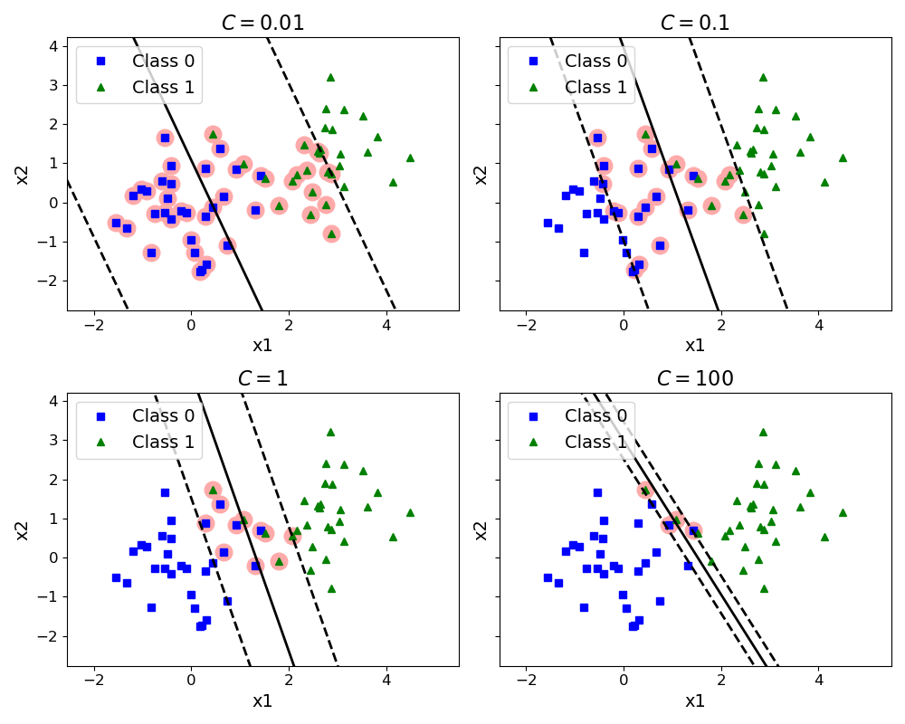
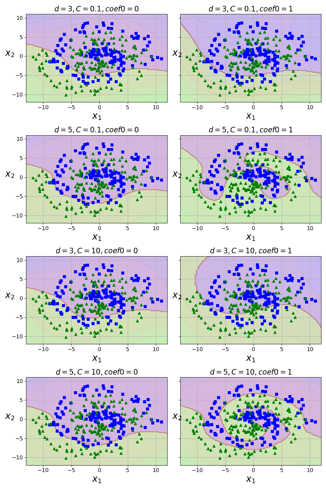
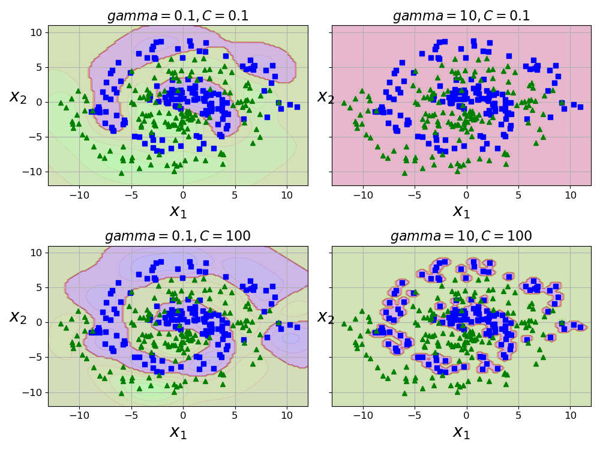

# Problem 1-1

**Used LLM** :  

**Code** :  
_Write down your code from First LLM_

**Code Description** :  
_Write down the description of the code from First LLM_

---

**Used LLM** :  

**Code** :  
_Write down your code from Second LLM_

**Code Description** :  
_Write down the description of the code from Second LLM with a focus on differences from first LLM_

---------------------
# Problem 1-2

**Used LLM** :  

**Code** :  
_Write down your code from First LLM_

**Code Description** :  
_Write down the description of the code from First LLM_

---

**Used LLM** :  

**Code** :  
_Write down your code from Second LLM_

**Code Description** :  
_Write down the description of the code from Second LLM with a focus on differences from first LLM_

---------------------
# Problem 2

**Plot** :

**Analysis** :
_Write an analysis of the plot results_

---------------------
# Problem 3-1

**Plot** :

**Analysis** :
_Write an analysis of the plot results_

---------------------
# Problem 3-2

**Plot** :

**Analysis** :
_Write an analysis of the plot results_

---------------------